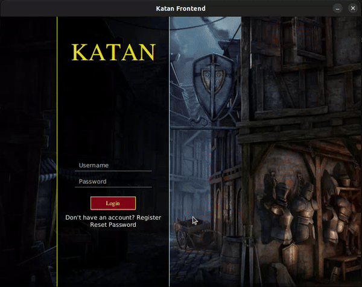
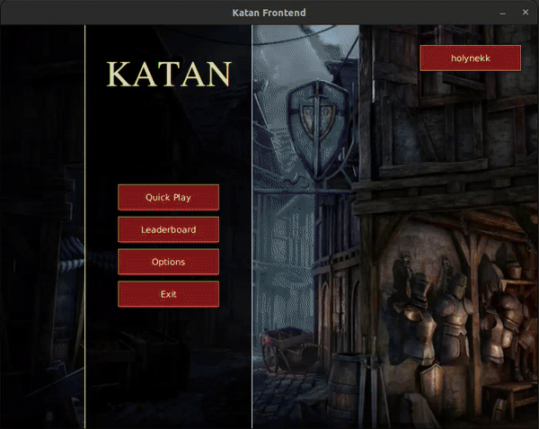
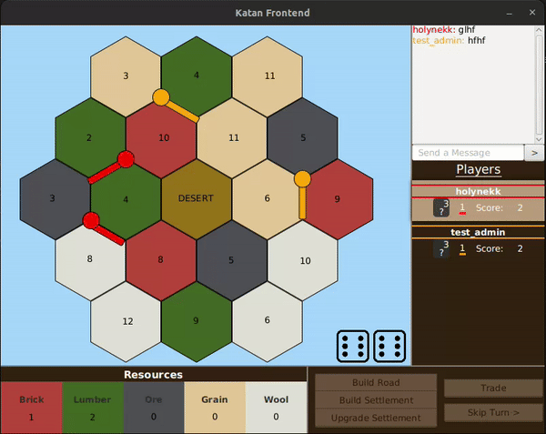

# Online Catan Game

## Overview

I developed and deployed an online Catan board game as a desktop application where players
can play against either cpu or other users. I have used Java/Springboot on backend,
JavaFX on frontend, mysql, and deployed it on Render.

## Documentation

<b>*Frontend documentation:*</b> https://holynekk.github.io/group12FrontendJavaDocs

<b>*Backend documentation:*</b> https://holynekk.github.io/group12BackendJavaDocs

(There is a postman collection in the folders. You can click [here](./backend/postman_collection/group12%20-%20Katan%20Backend.postman_collection.json) to see the collection file.)

After running the backend project, go to the link below to see the api documentation generated via swagger.

<b>***Url for the swagger on production environment:*</b> localhost:8080/swagger-ui/index.html

## Setup

## Ingame Images

You can create your user and login.

Go into the lobby, create a room or join others to play.

Have fun!

