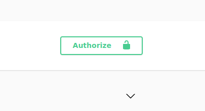

# Authors
- Mert Kaan YILMAZ (2381093)
- Umut YILMAZ (2449064)

<b>*General project documentation:*</b> holynekk.github.io/group12JavaDocs/

# Database Schema

# How to Use katanBackend API Service?

Go to the link below which is an api documentation generated via swagger.

<b>***Url for the swagger on production environment:*</b> group12-katan-backend.onrender.com/swagger-ui/index.html

There are different groups of endpoints to use. There is a session based authentication system which requires
you to log in first.

You have to create a basic authorization string by pressing the green button at the top right. Press it and
enter your credentials. Be aware that it will not give you any error, because it only creates a basic auth
string.

(There is already a user with username: test_admin password: adminKatan12group in the db. But you are also
free to create your own user and use it to logging in.)

Now, you have to hit the login endpoint to create a session and a session cookie to use it later.

After logging in successfully, you will have your session cookie token id to use it as you X-CSRF 
header value with other endpoints.

Before using any other endpoint(except create user and login endpoints) please fill in the X-CSRF
request header with the provided tokenId.

